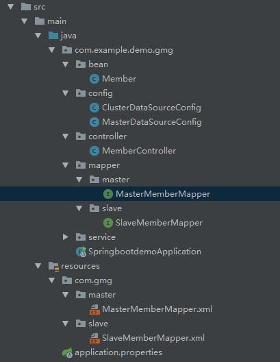

> " Springboot实现多数据源 ”

## Springboot实现多数据源

技术栈：springboot+mysql+mybatis

### 1、配置Maven:
```
<dependency>
  <groupId>org.springframework.boot</groupId>
  <artifactId>spring-boot-starter-web</artifactId>
</dependency>
<dependency>
  <groupId>mysql</groupId>
  <artifactId>mysql-connector-java</artifactId>
  <scope>runtime</scope>
</dependency>
<dependency>
  <groupId>org.mybatis.spring.boot</groupId>
  <artifactId>mybatis-spring-boot-starter</artifactId>
  <version>1.3.2</version>
</dependency>
```
### 2、配置application.properties
```
## master
master.datasource.url=jdbc:mysql://localhost:3306/master?useUnicode=true&characterEncoding=utf8
master.datasource.username=root
master.datasource.password=082900
master.datasource.driverClassName=com.mysql.jdbc.Driver

## cluster
cluster.datasource.url=jdbc:mysql://localhost:3306/slave?useUnicode=true&characterEncoding=utf8
cluster.datasource.username=root
cluster.datasource.password=082900
cluster.datasource.driverClassName=com.mysql.jdbc.Driver

```
### 3、加载配置
下面是master数据源对应的配置，cluster同理。
```
@Configuration
// 扫描 Mapper 接口并容器管理
@MapperScan(basePackages = MasterDataSourceConfig.PACKAGE, sqlSessionFactoryRef = "masterSqlSessionFactory")
public class MasterDataSourceConfig {

    // 精确到 master 目录，以便跟其他数据源隔离
    static final String PACKAGE = "com.example.demo.gmg.mapper.master";
    static final String MAPPER_LOCATION = "classpath:com/gmg/master/*.xml";

    @Value("${master.datasource.url}")
    private String url;

    @Value("${master.datasource.username}")
    private String user;

    @Value("${master.datasource.password}")
    private String password;

    @Value("${master.datasource.driverClassName}")
    private String driverClass;

    @Bean(name = "masterDataSource")
    @Primary
    public DataSource masterDataSource() {
        DruidDataSource dataSource = new DruidDataSource();
        dataSource.setDriverClassName(driverClass);
        dataSource.setUrl(url);
        dataSource.setUsername(user);
        dataSource.setPassword(password);
        return dataSource;
    }

    @Bean(name = "masterTransactionManager")
    @Primary
    public DataSourceTransactionManager masterTransactionManager() {
        return new DataSourceTransactionManager(masterDataSource());
    }

    @Bean(name = "masterSqlSessionFactory")
    @Primary
    public SqlSessionFactory masterSqlSessionFactory(@Qualifier("masterDataSource") DataSource masterDataSource)
            throws Exception {
        final SqlSessionFactoryBean sessionFactory = new SqlSessionFactoryBean();
        sessionFactory.setDataSource(masterDataSource);
        sessionFactory.setMapperLocations(new PathMatchingResourcePatternResolver()
                .getResources(MasterDataSourceConfig.MAPPER_LOCATION));
        return sessionFactory.getObject();
    }
}
```
### 4、编写业务逻辑
代码结构如下图:



具体的代码逻辑不再赘述，源代码[请戳](https://github.com/gmg0829/SpringbootLearningExample/tree/master/Springboot-MultiDataSource)  
